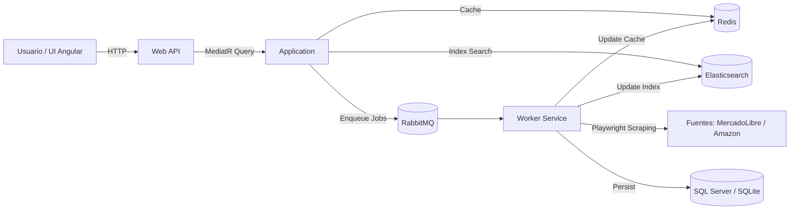

# EZPrice - Arquitectura y Funcionamiento

## Resumen
EZPrice es una solución basada en **Clean Architecture** con dos procesos principales:

- **Web**: API + front-end Angular para búsquedas y visualización de resultados.
- **Worker**: servicio en background que consume trabajos de búsqueda desde RabbitMQ, ejecuta scraping con Playwright y persiste resultados.

La lógica central de negocio vive en **Application** y **Domain**, mientras que **Infrastructure** implementa integraciones con bases de datos, cache, colas, búsqueda y scraping.

## Diagrama de alto nivel



## Capas y proyectos

**Domain**
- Entidades y value objects del negocio.
- Ejemplos: `Offer`, `SearchQuery`, `QueryKey`.

**Application**
- Casos de uso y contratos (interfaces) que no dependen de infraestructura.
- Ejemplos: `GetSearchResultsQuery`, `ISearchQueue`, `ISearchCache`, `ISearchIndex`, `ISourceScraper`.
- Normalización de queries mediante `IQueryNormalizer`.

**Infrastructure**
- Implementaciones concretas: EF Core, Redis, RabbitMQ, Elasticsearch, Playwright.
- Componentes clave:
  - `RabbitMqSearchQueue` (colas por fuente)
  - `RedisSearchCache` y `RedisSearchJobDeduper`
  - `ElasticsearchIndex`
  - `ScrapeResultStore` (persistencia + index + cache)
  - Scrapers Playwright (`AmazonScraper`, `MercadoLibreScraper`)

**Web**
- API HTTP (Minimal APIs) y host de la SPA Angular.
- Endpoint principal: `GET /search?q=...&page=...`.

**Worker**
- `BackgroundService` que consume colas de RabbitMQ por cada fuente configurada.
- Selecciona el scraper adecuado por `Source` y guarda resultados vía `IScrapeResultStore`.

**ClientApp (Angular)**
- UI que consume el endpoint de búsqueda.

## Flujo principal: búsqueda de productos

1. El usuario consulta `GET /search?q=...&page=...`.
2. `GetSearchResultsQueryHandler` normaliza el texto y genera un `QueryKey`.
3. Se intenta resolver desde cache (Redis).
4. Si hay cache válido, se devuelve inmediato. Si está **stale**, se devuelve cache y se dispara refresh.
5. Si no hay cache, se consulta Elasticsearch y se devuelve ese resultado inicial.
6. En paralelo, se encolan trabajos por cada fuente (RabbitMQ) usando deduplicación en Redis.
7. El **Worker** consume de `search.{source}`, ejecuta scraping con Playwright y construye `SearchResultItem`.
8. `ScrapeResultStore` persiste en DB, actualiza Elasticsearch y refresca el cache.

## Persistencia y consistencia

- **DB (EF Core)**: guarda `Offer` y `SearchQuery` (histórico y trazabilidad).
- **Elasticsearch**: indexa ofertas para búsquedas rápidas.
- **Redis**: cache de resultados y dedupe de jobs por fuente/página.
- Consistencia: el flujo es **eventualmente consistente**. El usuario puede ver resultados iniciales del index mientras se refresca en background.

## Scraping

- Basado en **Microsoft.Playwright** con opción de usar CDP (`PLAYWRIGHT_CDP_URL`).
- Configuración en `Scraping` controla timeouts, headless, user-agent y scrolling.
- Cada scraper expone `Source` y traduce HTML a `SearchResultItem`.

## Configuración clave

Configurado en `src/Web/appsettings.json` (también aplica para Worker):

- `Search`:
  - `CacheTtlSeconds`
  - `PageSize`
  - `Sources` (ej. `ml`, `amazon`)
- `Scraping`:
  - `Enabled`, `Headless`, `TimeoutMs`, `ScrollCount`, `UseCdpIfAvailable`, etc.
- `Redis`: `ConnectionString`
- `RabbitMQ`: `Host`, `Port`, `User`, `Password`, `VirtualHost`
- `Elasticsearch`: `Uri`, `IndexName`
- `ConnectionStrings:EZPriceDb` + `DatabaseProvider` (`Sqlite` o default SQL Server)

## Ejecución local (dev)

1. Levantar dependencias:

```bash
docker compose up -d
```

2. Ejecutar Web:

```bash
dotnet watch run --project src/Web
```

3. Ejecutar Worker:

```bash
dotnet run --project src/Worker
```

## Puntos de extensión

- Agregar una fuente nueva:
  - Implementar `ISourceScraper` en Infrastructure.
  - Registrar el scraper en `Infrastructure/DependencyInjection.cs`.
  - Agregar el `Source` en `SearchOptions`.
- Ajustar estrategias de cache/TTL o paginado.
- Cambiar el backend de búsqueda (otro índice) manteniendo la interfaz `ISearchIndex`.

## Archivos clave

- API búsqueda: `src/Web/Endpoints/Search.cs`
- Caso de uso: `src/Application/Search/Queries/GetSearchResultsQuery.cs`
- Worker: `src/Worker/SearchWorker.cs`
- Scraping: `src/Infrastructure/Scraping/*.cs`
- Persistencia/index/cache: `src/Infrastructure/Search/ScrapeResultStore.cs`
